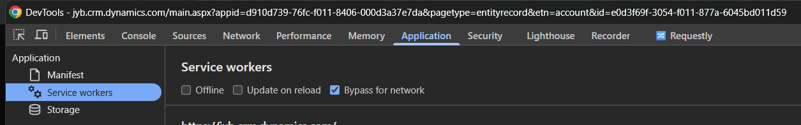

<p align="center">
  
</p>


# Resource Remix

Resource Remix is a Chrome Manifest V3 extension for redirecting page resources to replacement URLs during development.

The main workflow is replacing a remote resource with a locally served file, for example:

```text
https://example.com/static/app.js -> http://127.0.0.1:5173/app.js
```

## Install

1. Open `chrome://extensions`.
2. Enable **Developer mode**.
3. Click **Load unpacked**.
4. Select `src/ResourceRemix`.
5. Click the Resource Remix toolbar icon to open the settings tab.

## Local Files

Serve your override files from a local folder:

```powershell
cd C:\path\to\override-files
npx http-server . -p 5173 --cors
```

Use a server that sends CORS headers. This is necessary when the replacement resource is loaded through XHR, `fetch`, module scripts, or any browser path that enforces cross-origin reads. Plain static scripts may work without CORS, but CORS support is the safer default for local overrides.

## Add A Rule

1. Open the **Rules** tab.
2. Click **Add Rule**.
3. Pick a match type:
   - `Exact URL`: the full request URL must match.
   - `Contains`: the request URL must contain the text.
   - `Regex`: Chrome DNR-compatible regex match.
4. Enter the original request URL or URL stub.
5. Enter the replacement URL, such as `http://127.0.0.1:5173/foo.js`.
6. Save the rule.


## Required DevTools Settings

When testing overrides, Chrome cache and page service workers can make it look like a rule is not working.

In the target page's DevTools:

1. Open the **Network** tab and enable **Disable cache** while DevTools is open.
2. Open **Application > Service workers**.
3. Enable **Bypass for network**.
4. Hard reload the page.



## Common Issues

If a rule appears in **Recent Matches** but the page still does not use the replacement file:

- Check whether the Network row is served from memory or disk cache.
- Enable **Bypass for network** for the page service worker.
- Verify the replacement URL can be opened directly in the browser.
- Check the Console for CSP, CORS, or mixed-content errors.
- For local HTTP replacements, prefer `http://127.0.0.1:5173/...` or `http://localhost:5173/...`.

## Notes

Resource Remix uses Chrome `declarativeNetRequest` dynamic rules. It redirects requests; it does not edit response bodies in place.

## AI Disclosure
- AI-assisted tooling was used in the development of this codebase.

## License
- License: [MIT](LICENSE)
